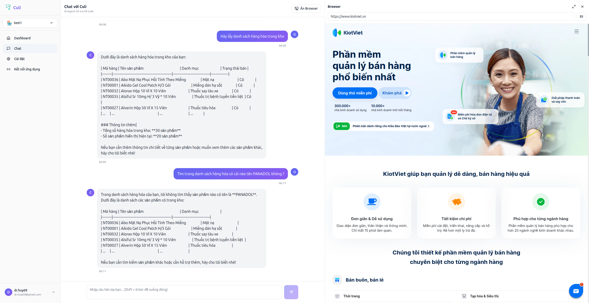

# Culi Backend

AI kế toán cho hộ kinh doanh Việt Nam, kết nối với các ứng dụng quản lý bán hàng và kế toán.



**Ngôn ngữ**: [English](README_en.md) | [Tiếng Việt](README.md)

## 🌐 Live Demo

**Trải nghiệm Culi ngay bây giờ**: [https://culi.ddns.net/](https://culi.ddns.net/)

Demo này cho phép bạn:
- 💬 Chat với AI agent về kế toán và thuế
- 🔌 Kết nối với các ứng dụng quản lý bán hàng (KiotViet, Misa eShop, ...)
- 📊 Xem và quản lý dữ liệu từ các ứng dụng đã kết nối
- ⚙️ Quản lý workspaces và cài đặt

## 📖 Tổng quan

Culi Backend là một AI agent hỗ trợ kế toán cho các hộ kinh doanh nhỏ tại Việt Nam. Hệ thống kết nối với các ứng dụng bên ngoài (như KiotViet, Misa eShop, v.v.) để đọc dữ liệu, tạo báo cáo, và thực hiện các thao tác tự động.

### Tính năng chính

- 🤖 **AI Assistant**: Trả lời câu hỏi về kế toán, thuế, quản lý bán hàng
- 🔌 **Kết nối ứng dụng**: Hỗ trợ kết nối với các ứng dụng quản lý bán hàng và kế toán
- 📊 **Đọc dữ liệu**: Lấy danh sách sản phẩm, hóa đơn, báo cáo từ các ứng dụng đã kết nối
- 🎯 **Lập kế hoạch & thực thi**: Tạo và thực thi kế hoạch phức tạp để thao tác trên ứng dụng
- 🌐 **Tìm kiếm web**: Tìm kiếm thông tin về thuế, quy định pháp luật

## 🚀 Quick Start

### Yêu cầu

- Python 3.10+
- Docker & Docker Compose
- Git

### Cài đặt nhanh

1. **Clone repository:**
   ```bash
   git clone <repository-url>
   cd culi
   ```

2. **Setup môi trường:**
   ```bash
   # Tạo virtual environment
   python3 -m venv venv
   source venv/bin/activate  # Linux/Mac
   # hoặc: venv\Scripts\activate  # Windows

   # Cài đặt dependencies
   pip install -r requirements.txt
   ```

3. **Cấu hình environment:**
   ```bash
   cp .env.example .env
   # Chỉnh sửa .env với API keys của bạn
   ```

4. **Start dependencies:**
   ```bash
   cd local_dev
   docker compose up -d postgres
   cd ..
   ```

5. **Setup database:**
   ```bash
   # Tạo migration đầu tiên
   alembic revision --autogenerate -m "Initial migration"
   
   # Apply migration
   alembic upgrade head
   ```

6. **Start server:**
   ```bash
   uvicorn app.main:app --reload --port 8000
   ```

Server sẽ chạy tại: http://localhost:8000  
API Documentation: http://localhost:8000/docs

### 📚 Hướng dẫn chi tiết

- **[Local Development Setup](local_dev/README.md)** - Hướng dẫn setup và phát triển chi tiết từng bước | [English](local_dev/README_en.md)
- **[Architecture Documentation](docs/ARCHITECTURE.md)** - Thiết kế hệ thống, LangGraph, adapter pattern | [English](docs/ARCHITECTURE_en.md)
- **[Database Migrations](migrations/README.md)** - Quản lý database migrations | [English](migrations/README_en.md)

## 🏗️ Kiến trúc

### Tech Stack

- **FastAPI** - Web framework
- **SQLAlchemy + Alembic** - ORM và database migrations
- **PostgreSQL** - Database
- **LangChain + LangGraph** - AI agent orchestration
- **OpenRouter** - LLM provider (GPT-4, Llama, etc.)
- **Google Custom Search API** - Web search

### Kiến trúc tổng quan

```
┌─────────────────┐
│   FastAPI App   │
└────────┬────────┘
         │
         ├─── API Routes (REST)
         ├─── Services (Business Logic)
         └─── LangGraph (AI Agent)
                  │
                  ├─── Intent Router
                  ├─── Context Loading
                  ├─── App Adapters (KiotViet, ...)
                  ├─── Web Search
                  └─── Answer Generation
```

### LangGraph Workflow

Hệ thống sử dụng LangGraph để quản lý workflow xử lý câu hỏi:

```
User Input
    ↓
Intent Router (phân loại intent)
    ↓
┌─────────────────────────────────────┐
│ general_qa → Context → Answer       │
│ tax_qa → Web Search → Answer        │
│ app_read → App Read → Answer        │
│ app_plan → Plan → Execute → Answer  │
└─────────────────────────────────────┘
```

Xem chi tiết tại: **[docs/ARCHITECTURE.md](docs/ARCHITECTURE.md)**

### Adapter Pattern

Hệ thống sử dụng adapter pattern để hỗ trợ nhiều loại ứng dụng:

- **Supported Apps** (API): KiotViet, Misa eShop, v.v. - có source code riêng
- **Custom Apps** (MCP): Model Context Protocol servers - generic integration
- **App Categories**: POS_SIMPLE, ACCOUNTING, UNKNOWN

Xem chi tiết tại: **[docs/ARCHITECTURE.md](docs/ARCHITECTURE.md#adapter-pattern)**

## 📁 Cấu trúc Project

```
culi/
├── app/                      # Application code
│   ├── api/                  # API routes
│   │   └── v1/               # API version 1
│   ├── core/                 # Core configuration
│   ├── db/                   # Database setup
│   ├── domain/               # Domain logic
│   │   └── apps/             # App adapters
│   │       ├── base.py       # Base adapter interface
│   │       ├── registry.py   # Adapter registry
│   │       └── kiotviet/     # KiotViet adapter
│   ├── graph/                # LangGraph definitions
│   │   ├── state.py          # State definition
│   │   ├── nodes/            # Graph nodes
│   │   └── app_graph.py      # Graph builder
│   ├── models/               # Database models
│   ├── repositories/         # Data access layer
│   ├── services/             # Business logic
│   └── utils/                # Utilities
├── docs/                     # Documentation
│   ├── ARCHITECTURE.md       # Architecture documentation
│   ├── langgraph_chart.mmd   # LangGraph visualization
│   └── web-interface-screenshot.png  # Web interface screenshot
├── local_dev/                # Local development
│   ├── docker-compose.yml    # Docker services
│   └── README.md             # Local setup guide
├── migrations/               # Database migrations
│   └── README.md             # Migration policy
├── scripts/                  # Utility scripts
├── tests/                    # Tests
├── requirements.txt          # Python dependencies
└── README.md                 # This file
```

## 🔧 Development

### Local Development Workflow

Hệ thống sử dụng **hybrid approach**:
- **Dependencies** (PostgreSQL, Redis) chạy trong Docker
- **Application code** chạy trực tiếp trên máy local (hot reload)

Xem hướng dẫn chi tiết: **[local_dev/README.md](local_dev/README.md)**

### Common Commands

```bash
# Start dependencies
cd local_dev && docker compose up -d postgres

# Start development server
uvicorn app.main:app --reload --port 8000

# Run tests
pytest

# Format code
black app/ tests/

# Lint code
ruff check app/ tests/
```

## 📝 Database Migrations

Migrations **không được include** trong open source repository. Mỗi deployment sẽ tự quản lý migrations.

Xem chi tiết: **[migrations/README.md](migrations/README.md)**

## 🔐 Environment Variables

Các biến môi trường quan trọng:

- `DATABASE_URL` - PostgreSQL connection string
- `SECRET_KEY` - JWT secret key (tối thiểu 32 ký tự)
- `OPENROUTER_API_KEY` - OpenRouter API key (required)
- `ENCRYPTION_KEY` - Fernet key để encrypt sensitive data (generate bằng `scripts/generate_encryption_key.py`)
- `GOOGLE_SEARCH_API_KEY` - Google Custom Search API key (optional)
- `GOOGLE_SEARCH_CX` - Google Custom Search Engine ID (optional)

Xem file `.env.example` để biết đầy đủ các biến môi trường.

## 🤝 Contributing

1. Fork repository
2. Tạo feature branch (`git checkout -b feature/amazing-feature`)
3. Commit changes (`git commit -m 'Add amazing feature'`)
4. Push to branch (`git push origin feature/amazing-feature`)
5. Tạo Pull Request

## 📄 License

[Your License Here]

## 🔗 Links

- **🌐 Live Demo**: [https://culi.ddns.net/](https://culi.ddns.net/)
- **API Documentation**: http://localhost:8000/docs (khi server đang chạy)
- **Architecture Docs**: [docs/ARCHITECTURE.md](docs/ARCHITECTURE.md)
- **Local Setup Guide**: [local_dev/README.md](local_dev/README.md)
- **Migration Policy**: [migrations/README.md](migrations/README.md)

## 🆘 Troubleshooting

Nếu gặp vấn đề, xem phần Troubleshooting trong:
- **[local_dev/README.md](local_dev/README.md#troubleshooting)** - Các vấn đề thường gặp khi setup local

---

**Made with ❤️ for Vietnamese small businesses**
